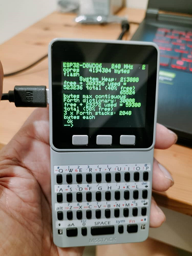

# ESP32forth Contributions by Jason Tay

## ESP32 Benchmarks
The benchmark related files and presentation are in the "esp32" folder.

## ESP32forth SPI support
Noticing that there didn't seem to be a thin interface API layer for SPI hardware support, I decided to try writing my own. I have structured it
as a userwords.h file which can easily be added into your own ESP32forth Arduino project without having to edit the ESP32forth INO file itself.
In addition, I include an example of its use in Forth. Don't bit-bang, use this add this API layer into your ESP32forth firmware! See [forth-spi.md](https://github.com/Esp32forth-org/jasontay/blob/main/forth-spi.md) for more information.

## M5Stack Forth
The M5Stack platform would make a perfect portable, self-powered ESP32forth platform. However, to make use of all its features, ESP32forth needs 
some customisation. When used with the M5Stack Faces QWERTY keyboard combination, it promises the possibility of true mobility with ESP32forth.

## FizzBuzz
FizzBuzz is a simple interview algorithm challenge to figure out if your candidate can think or not... This is my take on implementing it in Forth as 
much as a practice exercise as to learn Forth.
